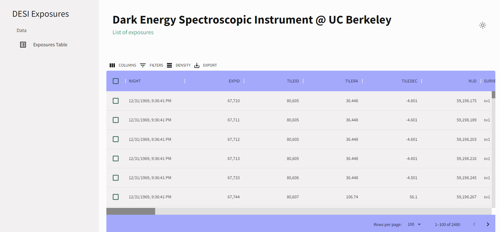

# Dark Energy Spectroscopic Instrument (DESI) Data Portal 

A Python Flask webapp that provides data access for the hundreds of terabytes of Dark Energy Spectroscopic Instrument (DESI) data at the National Energy Research Scientific Computing Center (NERSC).

The tools developed will be used by the ~500 person DESI collaboration, and by the worldwide astronomy community after the first DESI public data release in 2023.

The application uses Flask to surface data from a SQLite database to the DESI front-end client. Our webpage uses ReactJS, HTML, CSS to enable sorting, filtering, search, pagination, column hiding, and data exporting features.


[](https://opensource.org/licenses/BSD-3-Clause)

---

## Table of Contents

- [User Interface](#user-interface)
- [Installation](#installation)
- [License](#license)
- [Contact](#contact)

---

## **User Interface**

Simple Flask-React project that loads a dataframe into a SQLite database and shows the information on a webpage, shown below:  

### Darkmode


### Lightmode 




---

## **Installation**

### Clone Repository 

1. Clone this repository to your local machine using:

```
$ git clone https://github.com/trangnguyen12002/desi-data-urap.git
```

### Flask Server Setup


1. Install the required Python libraries:

```
$ pip install -r requirements.txt
```

2. Initialize the SQLite Database:

```
$ flask shell
>>> from app import db 
>>> db.create_all()
>>> quit()
```
3. Load exposures-fuji.csv to SQLite Database:

```
$ flask load-data exposures-fuji.csv
```

4. Start the Flask Server:

```
$ flask run 
```

### React Client Setup 

1. Install all dependencies:

```
$ npm install 
```

2. Start the React Client:

```
$ npm start
``` 

---

## **License**

This project is licensed under the BSD 3-Clause License. 

--- 

## **Contact**

For more information, feel free to contact me at trangnguyen12002@berkeley.edu :frog::crown:
